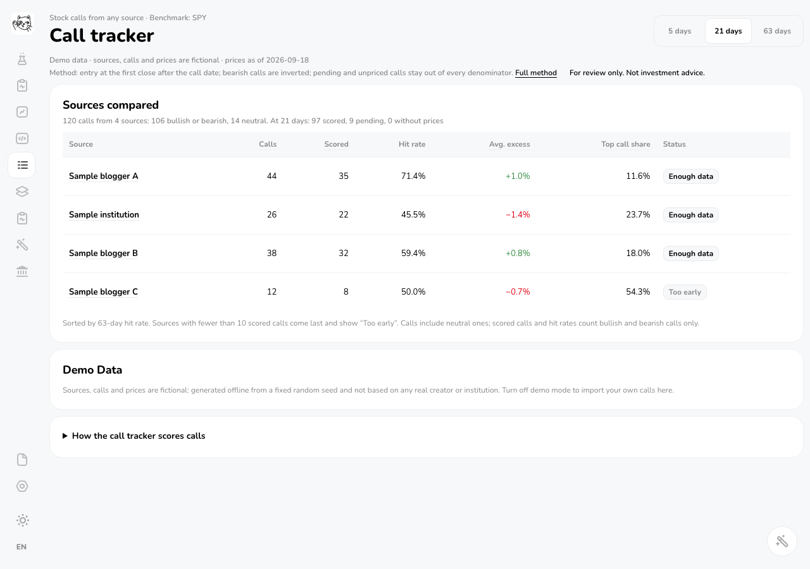
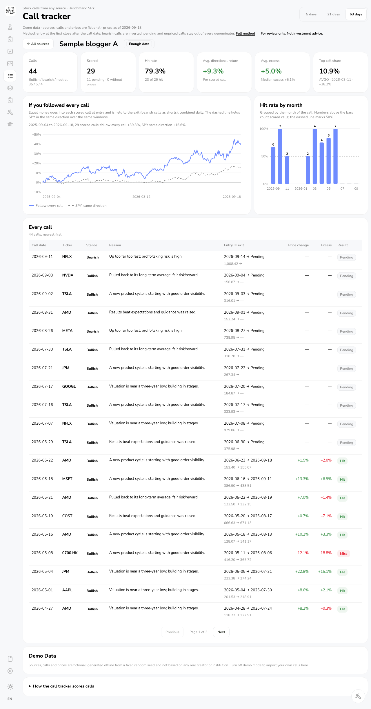

[English](../README.md#about-this-fork) | **简体中文**

# 关于这个 fork

这是 [irrwood/catfolio](https://github.com/irrwood/catfolio) 的 fork（在原项目基础上另行开发的副本）。感谢 [irrwood](https://github.com/irrwood) 开发 Catfolio，并以 MIT 许可证开源。这个 fork 新增了三项内容：

- **长桥（Longbridge）账户同步**：在“设置 → 账户”中连接一个长桥 OpenAPI 应用，以只读方式同步持仓和现金。长桥开发包（SDK）为可选安装，详见 [docs/web-account-sync.md](web-account-sync.md#longbridge)（英文）。
  - 上游 PR：[#6](https://github.com/irrwood/catfolio/pull/6)
- **观点记分牌**（`/calls`）：导入任何来源的带日期的个股观点（博主、投资通讯、分析师报告或你自己的投资日记），用观点发出后 5、21、63 个交易日的实际价格给它们打分，以 SPY（跟踪标普 500 指数的 ETF）为基准。每个来源都有命中率、“每次都跟”收益曲线和逐月命中率。详见 README 的 [Call Tracker](../README.md#call-tracker) 一节（英文）。
  - 上游 PR：[#7](https://github.com/irrwood/catfolio/pull/7)
- **小修复**：Moomoo（富途）的港股代码转成雅虎财经接受的四位补零格式（`HK.00700` → `0700.HK`）；Lab 和 CSV 导入的汇率表补上港币；删除指向已不存在的 `/sentiment` 页和目标价历史页（price-target-history）的失效链接。
  - 上游 PR：[#4](https://github.com/irrwood/catfolio/pull/4)（港股代码与港币汇率）、[#5](https://github.com/irrwood/catfolio/pull/5)（失效链接）

| 观点记分牌：各来源对比 | 观点记分牌：单个来源 |
| --- | --- |
|  |  |

两张截图都来自演示模式，所以其中的来源、观点和价格都是虚构的。想试用这些新增功能，请克隆这个 fork（`https://github.com/jackieyangjq/catfolio.git`），而不是 README 中 [Quick Start（快速开始）](../README.md#quick-start)一节所用的上游仓库。

其余部分都是上游 Catfolio 的原有内容，原始说明见 [README](../README.md)（英文）。
